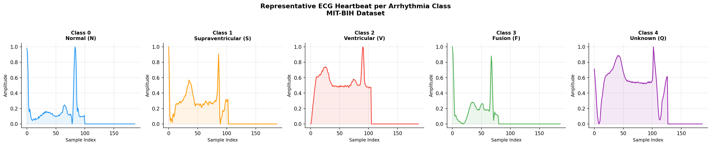
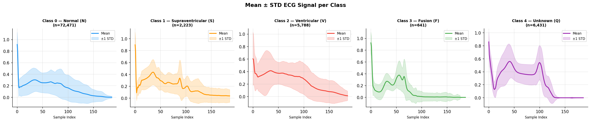
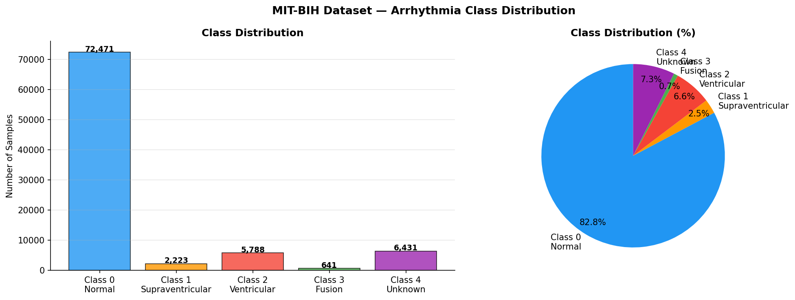
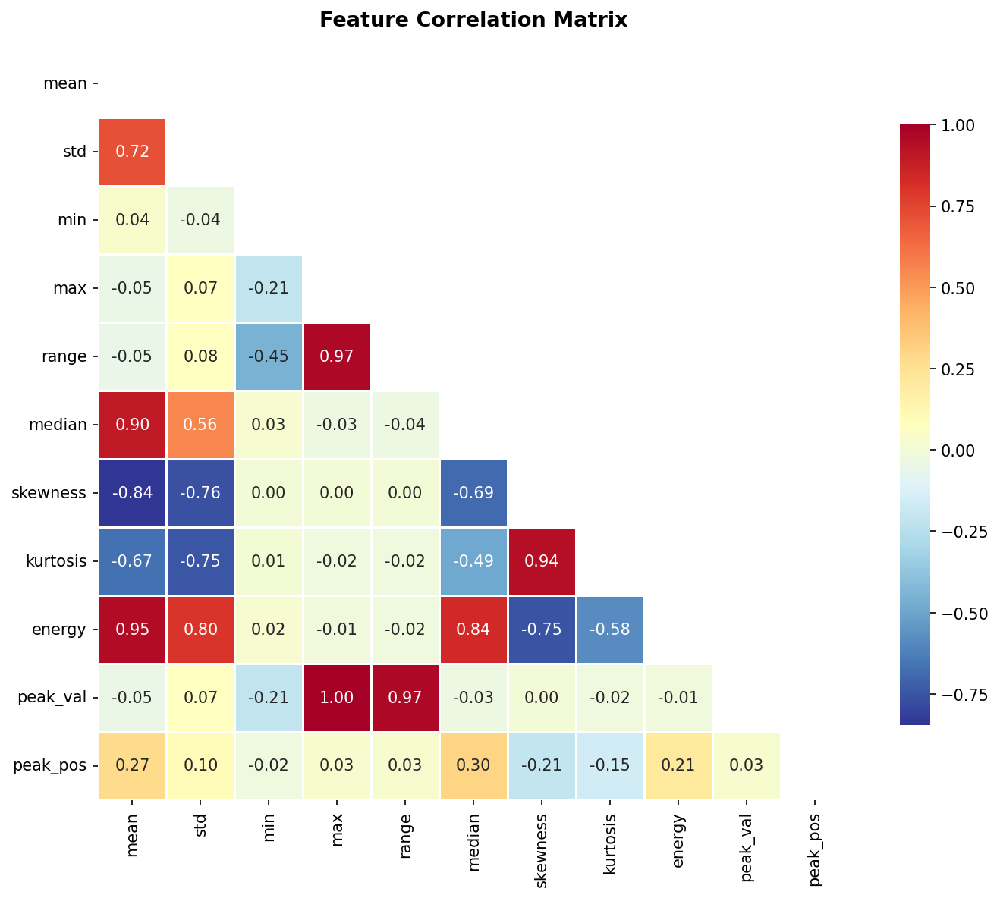
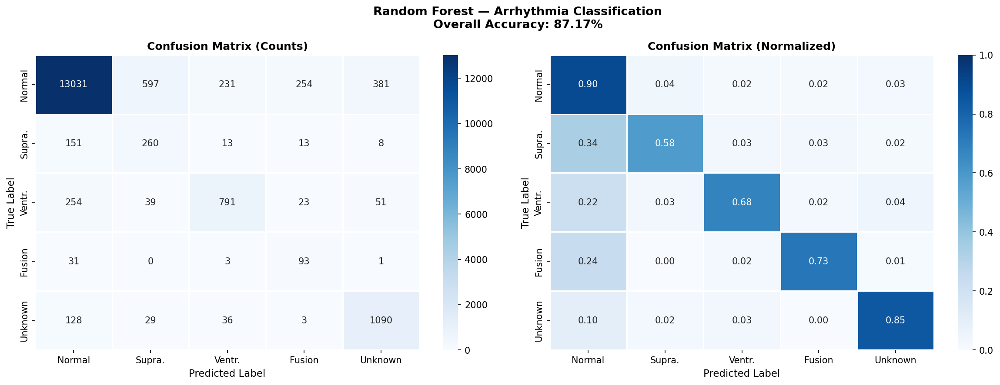
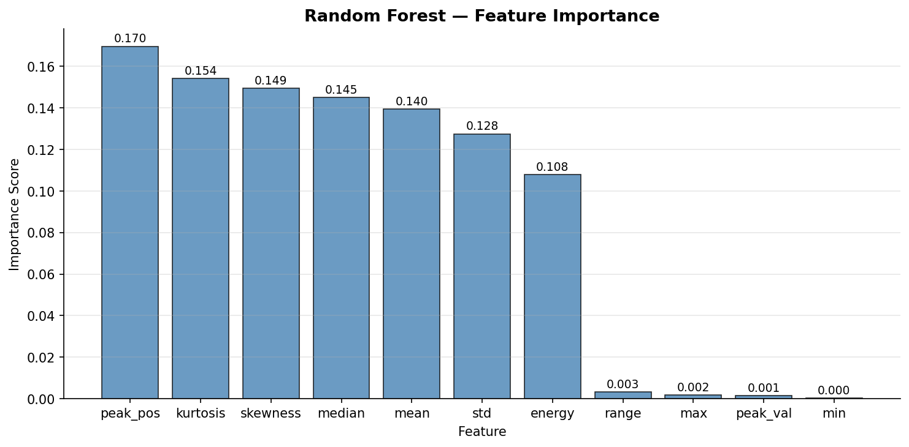

# 🫀 ECG Arrhythmia Classification


> A machine learning pipeline for automated ECG arrhythmia classification using the MIT-BIH dataset. Implements statistical feature engineering and a Random Forest classifier to distinguish between 5 cardiac rhythm categories.

---

## 📌 Overview

This project implements an end-to-end **ECG signal classification pipeline** on the publicly available [MIT-BIH Arrhythmia Dataset](https://www.kaggle.com/datasets/shayanfazeli/heartbeat). Each sample represents a single heartbeat encoded as 187 time-series values. The goal is to automatically classify each heartbeat into one of five arrhythmia categories — a clinically relevant task in automated cardiac monitoring.

---

## 🎯 Key Results

| Metric | Value |
|---|---|
| Dataset | MIT-BIH Arrhythmia (87,554 samples) |
| Features | 10 statistical/morphological features per beat |
| Classifier | Random Forest (100 estimators, balanced weights) |
| Train/Test Split | 80% / 20% stratified |

---

## 🗂️ Project Structure

```
ecg-arrhythmia-classification/
│
├── notebooks/
│   └── ECG_Analysis_Enhanced.ipynb   # Full pipeline (annotated)
│
├── outputs/
│   ├── 01_ecg_classes.png            # Sample heartbeat per class
│   ├── 02_mean_signals.png           # Mean ± STD signal per class
│   ├── 03_class_distribution.png     # Class imbalance visualization
│   ├── 04_feature_correlation.png    # Feature correlation heatmap
│   ├── 05_confusion_matrix.png       # Classification results
│   └── 06_feature_importance.png     # Random Forest feature ranking
│
└── README.md
```

---

## ⚙️ Pipeline

```
Raw ECG CSV
      │
      ▼
[1] Load & Inspect         pd.read_csv()
      │                    → 87,554 samples × 188 columns
      ▼
[2] Signal Visualization   Per-class heartbeat plots
      │                    → Mean ± STD shading
      ▼
[3] Feature Engineering    10 features per heartbeat
      │                    → mean, std, min, max, range,
      │                       median, skewness, kurtosis,
      │                       energy, peak position
      ▼
[4] Train/Test Split       80% train / 20% test (stratified)
      │
      ▼
[5] Random Forest          100 estimators, balanced weights
      │                    → Handles class imbalance
      ▼
[6] Evaluation             Confusion matrix + classification report
                           → Per-class precision, recall, F1
```

---

## 🏷️ Arrhythmia Classes

| Class | Label | Description |
|---|---|---|
| 0 | Normal (N) | Normal sinus rhythm |
| 1 | Supraventricular (S) | Supraventricular ectopic beat |
| 2 | Ventricular (V) | Ventricular ectopic beat |
| 3 | Fusion (F) | Fusion beat |
| 4 | Unknown (Q) | Unclassifiable beat |

---

## 📊 Visualizations

### ECG Signal per Arrhythmia Class


### Mean ± STD Signal per Class


### Class Distribution


### Feature Correlation Matrix


### Confusion Matrix


### Feature Importance


---

## 🚀 Getting Started

### 1. Clone the repository
```bash
git clone https://github.com/Sinansteiger/ecg-arrhythmia-classification.git
cd ecg-arrhythmia-classification
```

### 2. Install dependencies
```bash
pip install pandas numpy matplotlib seaborn scikit-learn jupyter
```

### 3. Download the dataset
Download `mitbih_train.csv` from [Kaggle — Heartbeat Dataset](https://www.kaggle.com/datasets/shayanfazeli/heartbeat) and place it in the project root.

### 4. Run the notebook
```bash
jupyter notebook notebooks/ECG_Analysis_Enhanced.ipynb
```

> **Note:** Update the `pd.read_csv()` path in the notebook to match your local directory.

---

## 🧰 Dependencies

| Package | Purpose |
|---|---|
| `pandas` | Data loading and manipulation |
| `numpy` | Numerical computation |
| `matplotlib` | Signal and result visualization |
| `seaborn` | Statistical plots |
| `scikit-learn` | Random Forest, metrics, train/test split |
| `jupyter` | Interactive notebook environment |

---

## 📚 References

1. Moody, G.B., Mark, R.G. (2001). The impact of the MIT-BIH Arrhythmia Database. *IEEE Engineering in Medicine and Biology*, 20(3), 45–50.
2. Goldberger, A., et al. (2000). PhysioBank, PhysioToolkit, and PhysioNet. *Circulation*, 101(23).
3. Fazeli, S. (2018). Heartbeat Dataset. *Kaggle*. https://www.kaggle.com/datasets/shayanfazeli/heartbeat
4. Breiman, L. (2001). Random Forests. *Machine Learning*, 45, 5–32.

---

## 📄 License

This project is licensed under the MIT License.

---

## 🙋 Author

**Sinan Berke AKÇA**
- GitHub: [@Sinansteiger](https://github.com/Sinansteiger)
- LinkedIn: [linkedin.com/in/sinan-berke-akça-623716256](https://www.linkedin.com/in/sinan-berke-akça-623716256)

---

*If you find this project useful, please consider giving it a ⭐*
